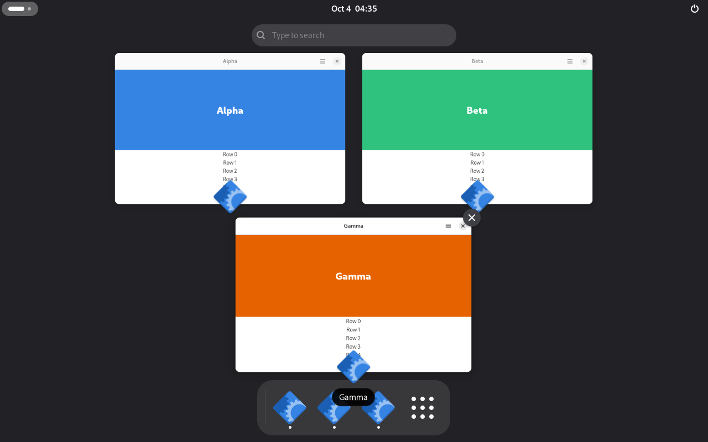
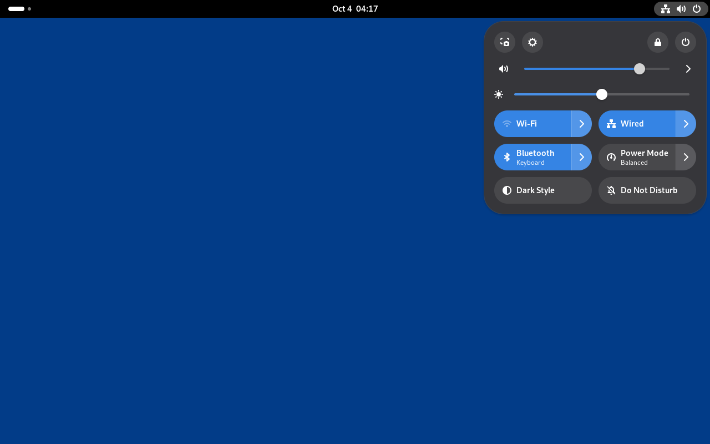
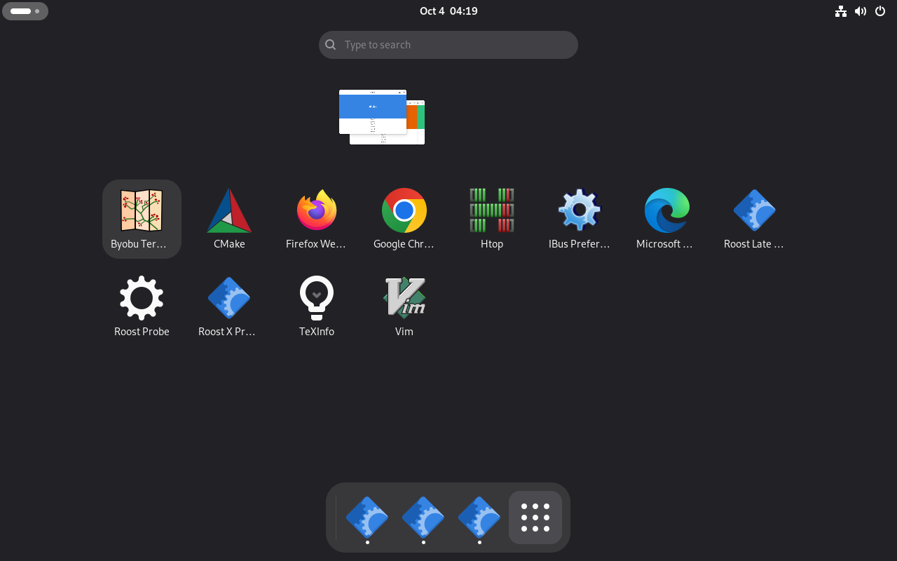
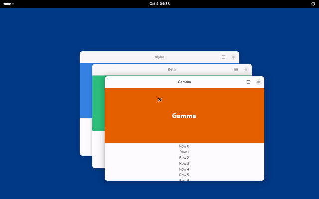

# Roost

A new, independent Wayland desktop session with a GNOME-inspired everyday workflow. This project is not a GNOME Shell rewrite and does not promise compatibility with GNOME Shell extensions or private Mutter APIs.

The compositor is a long-lived Rust process built with Smithay. The shell UI runs as a supervised Wayland client. The first delivery target is a nested developer preview that can map ordinary applications and recover its shell UI after a shell crash.

See the [walkthrough](docs/walkthrough.md) for every feature as it looks
today, in frames the GTK shell proof takes on each change.

## Screenshots and overview demo



| Quick settings | App grid |
| --- | --- |
|  |  |



[Play or download the overview video (MP4, 12 seconds)](docs/walkthrough/overview-demo.mp4).
The demo shows an actual nested Roost session with three libadwaita test windows.
See [capture details](docs/walkthrough/README-media.md) for source revisions and reproduction.

## Project status

**Nested developer preview.** A Smithay compositor supervises a GTK4/libadwaita
shell with overview window previews, app grid and search, quick settings,
notifications, calendar, keyboard navigation and AT-SPI accessibility. Roost
also includes its session supervisor, shell host, greetd greeter and versioned
control protocol. Floating windows, workspaces, Alt-Tab, half tiling, scrollable
tiling and XWayland are covered by graphical CI journeys.

The DRM/KMS backend starts hardware sessions and is tested with virtual KMS
in CI. Physical GPU, VT, suspend and long-running release qualification remain
open. See [the parity ledger](docs/parity-ledger.md) for measured behavior and
remaining gaps.

**Parity target:** GNOME 51. Native GNOME 51 captures provide the visual
reference. The published Marlin image was verified as GNOME Shell 50.5 on
2026-10-04; a GNOME 51 Marlin benchmark image is being validated separately.

**Target platform:** Roost is being tested as a TunaOS Marlin flavor (Arch
base, bootc image). The Debian package remains for local development hosts.

**Roadmap:** tracked as GitHub issues on the Roost roadmap project board;
[docs/roadmap.md](docs/roadmap.md) keeps the program structure, gates, and
requirement traceability.

## Prerequisites

- **Rust stable** with `rustfmt` and `clippy` (CI uses the current stable
  toolchain; no MSRV is declared, crates use edition 2021).
- **System libraries**: libseat, libinput, libudev, GBM, libdrm,
  libxkbcommon, GTK 4, libadwaita, PipeWire, Wayland and gtk4-layer-shell
  development files, plus EGL (Mesa llvmpipe is enough) to run a nested
  session. The [development guide](docs/development.md#prerequisites)
  has the exact Ubuntu and Arch package lists CI uses.
- **Spektacular CLI**, only for spec and plan work, not for building or
  running Roost:
  `go install github.com/hivecommons/spektacular@latest`, then
  `spektacular version check` (see [Continue with Spektacular](#continue-with-spektacular)).

## Contributing and Development

**Want to contribute?** Start with the [development guide](docs/development.md). It covers:
- Setting up your build environment
- Understanding the project structure
- Running a nested Roost session locally ([troubleshooting](docs/nested-session.md#troubleshooting))
- [Running tests locally](docs/testing.md), the same checks CI runs
- Spektacular workflows for planning and tracking

## Planning

- [Program architecture](docs/architecture.md)
- [Program roadmap and requirement traceability](docs/roadmap.md)
- [Parent requirement register](docs/requirements.md)
- [Verification and test strategy](docs/test-strategy.md)
- [Research intake rules](docs/research/README.md)
- [First spek: nested compositor and shell recovery](.spektacular/specs/20260927170317-a01f0011-001-nested-compositor-shell-recovery.md)
- [Architecture decisions](docs/adr/README.md)
- [Contributing](CONTRIBUTING.md)

Spektacular is initialized for Codex. Specs and plans are managed through its CLI; each program unit has a spek plus draft plan, context, and research artifacts. Draft plans must be reviewed against current implementation and open decision gates before their implementation workflow starts.

## Continue with Spektacular

Install the CLI if needed (`go install github.com/hivecommons/spektacular@latest`), then ensure `$(go env GOPATH)/bin` is on `PATH`.

Use the spek's full timestamp-prefixed name from `spektacular spec file list`:

```sh
spektacular version check
spektacular plan new --data '{"name":"20260927170317-a01f0011-001-nested-compositor-shell-recovery"}'
```

The plan workflow should refresh its draft from the current source and the linked spek. Complete its walkthrough and review before starting implementation. The implementation workflow starts with the corresponding full plan name after approval. See [Spektacular](https://github.com/hivecommons/spektacular) for the current workflow and CLI details.

## License

GPL-3.0-or-later. See [LICENSE](LICENSE).
