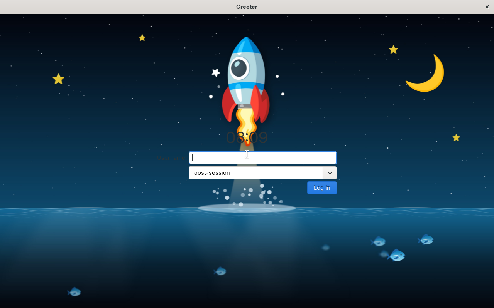
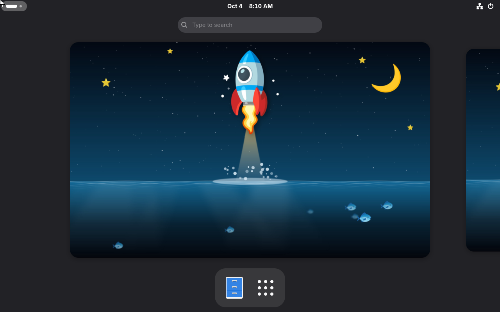

# Experimental Marlin Roost flavor acceptance, 2026-10-04

[TunaOS PR #2991](https://github.com/tuna-os/tunaOS/pull/2991) merged as `abc7e4c19edd3bd20ddae9d8f633d375a8e82247` after all source checks passed on `ab091c546ec3f21ad266583a557bc48ec296fd5e`. [Build run 37185293793](https://github.com/tuna-os/tunaOS/actions/runs/37185293793) passed image build, installed desktop contract, boot gate, signing and promotion for the single admitted amd64 cell. No ISO/LUKS cells were added.

The exact image tested on AWS KubeVirt was:

```text
ghcr.io/tuna-os/marlin@sha256:41d733afd5fd3bd8675c69f2006f89c821aa4262ed2b1c2ed09401d7ba33233b
```

The owned VM switched to that immutable image using `bootc switch`, then rebooted. `boot-proof.txt` records the matching booted digest, no staged update, no `/usr` overlay, composefs and systemd boot, the installed signed `roost 0.1.0-2` package, shipped greetd configuration and wrapper, and all six binary hashes. `installer-runtime-proof.txt` independently records ext4, systemd-boot and the six matching `0.1.0` binary versions. Temporary trace configuration and test binary wrappers were removed before this boot.

The shipped Cage/gtkgreet picker offered `roost-session`. Real fixture credentials were entered at that picker, and PAM opened the session as the non-root UID1000 test owner. `login-proof.txt` records the greetd session and compositor, shell and IBus processes. These are actual VM screenshots:





The signed served package was published and clean-installed in [package run 37185125494](https://github.com/tuna-os/tunaos-packages/actions/runs/37185125494), from [package PR #791](https://github.com/tuna-os/tunaos-packages/pull/791), pinned to Roost `c28f96ebaa1fdf016308904bb4af4ec7922aacac`. The screenshots and logs qualify that declared payload. Later upstream fixes need a package/image refresh before endurance qualification.

This establishes the initial flavor acceptance for [Roost #69](https://github.com/hanthor/roost-desktop/issues/69) and [TunaOS #2990](https://github.com/tuna-os/tunaOS/issues/2990). It does not establish a completed 24-hour soak, suspend/VT acceptance, performance parity, physical GPU support or daily-driver readiness. The AWS VM profile uses four vCPUs, 6 GiB RAM and bochs-drm; its scope must not be generalized to other hardware.
