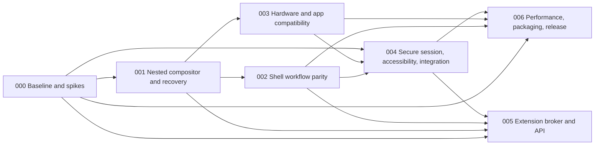

# Program roadmap and traceability

**Status:** Active. Tier 1 (nested developer preview) is implemented; tier 2 (daily-driver candidate) is open. Work items live as GitHub issues on the [Roost roadmap project board](https://github.com/users/hanthor/projects/4); this document keeps the program structure, gates, and traceability.
**Architecture:** [Program architecture](architecture.md)  
**Parity baseline:** GNOME 51, as shipped in the TunaOS Marlin GNOME image (`ghcr.io/tuna-os/marlin:gnome`). Decided 2026-10-01.  
**Target platform:** TunaOS Marlin (Arch Linux base, bootc image), as a Roost flavor alongside the GNOME flavor. Reference and candidate run on the same VM image family so comparisons are like for like.  
**Planning system:** Spektacular spec → plan → implement. Every delivery unit has a spek, a reviewed implementation plan, evidence, and an explicit gate.

## Delivery tiers

The project board's `1 Nested preview`, `2 Daily-driver candidate`, `3 Later`, and `Cross-cutting` values map to [the architecture tiers](architecture.md#delivery-tiers). A merged implementation is not a passed release gate: physical hardware, security, visual comparison and endurance evidence must still be recorded. [ADR 0007](adr/0007-gnome51-marlin-baseline.md) records the baseline and target choices.

## Delivery sequence

Specs 002 and 003 may proceed in parallel after the 001 compositor/control contract is stable. Spec 004 may prototype service/accessibility work earlier, but its production acceptance depends on shell and hardware behavior. Spec 006 is the integration and release dossier. Spec 005 is optional post-core work and is not a prerequisite for 1.0 unless release scope explicitly changes.

## Spek and plan registry

| ID | Spek | Purpose | Depends on | Release relationship |
|---|---|---|---|---|
| 000 | [Program baseline and technical spikes](../.spektacular/specs/20260927170316-a01f0010-program-baseline-and-spikes.md) | Baseline GNOME, compare toolkit/accessibility, Smithay/protocol spike, threat model | None | Required evidence before committing major implementation decisions; nested prototype may proceed with provisional assumptions |
| 001 | [Nested compositor and shell recovery](../.spektacular/specs/20260927170317-a01f0011-001-nested-compositor-shell-recovery.md) | First buildable vertical slice; app mapping and supervised shell recovery | 000 inputs | Developer preview foundation |
| 002 | [Shell workflow parity](../.spektacular/specs/20260927170318-a01f0012-shell-workflow-parity.md) | Overview, launcher/search, panel, quick settings, notifications, workspace journeys | 000, 001 | Required for daily-driver candidate |
| 003 | [Hardware and app compatibility](../.spektacular/specs/20260927170319-a01f0013-hardware-and-app-compatibility.md) | DRM/KMS, outputs, XWayland, scaling, IME, data devices, devices and rendering fallbacks | 000, 001 | Required for daily-driver candidate |
| 004 | [Secure session, accessibility, and system integration](../.spektacular/specs/20260927170320-a01f0014-secure-session-accessibility-integration.md) | Lock/auth, portals, AT-SPI journeys, settings and existing services | 000, 001, 002, 003 | Mandatory 1.0 security/usability gate |
| 005 | [Extension broker and public API](../.spektacular/specs/20260927170321-a01f0015-extension-broker-and-api.md) | Capability-limited, out-of-process extensions | 000, 001, 002, 004 | Optional later capability; excluded from initial 1.0 unless explicitly promoted |
| 006 | [Performance, packaging, and release readiness](../.spektacular/specs/20260927170322-a01f0016-performance-packaging-and-release.md) | Benchmarks, CI/conformance, package/rollback and release evidence | 000, 001, 002, 003, 004 | Required for daily-driver candidate |

The plan store contains `plan.md`, `context.md`, `research.md`, and `test-plan.md` for each unit. Plans are drafts until reviewed against current source, confirmed dependencies, and explicit acceptance evidence. Do not begin implementation from a draft plan if a blocking decision or security boundary is unresolved.

## Requirement traceability

Parent requirements `R1`–`R16` are defined in the
[parent requirement register](requirements.md). A bare `R<n>` in this
document is a parent requirement; a spec's own requirements are written
with their spek number (`001-R5`), per the register's naming rule.

| Parent requirement area | Owning spek(s) | Evidence at completion |
|---|---|---|
| R1 Activities/overview; R2 launch/search; R3 panel/system controls | 002; 004 for service backend | Baseline journeys, recordings, responsiveness/failure cases |
| R4 windows/workspaces/input gestures | 001 foundation; 002 parity; 003 output/input compatibility | lifecycle and focus tests; hotplug and gesture journeys |
| R5 notifications | 002 UI/behavior; 004 service and locked privacy | freedesktop notification matrix, history/actions/DND and locked behavior |
| R6 session/lock | 004 | lock fail-closed, PAM handoff, VT/resume/hotplug fault evidence |
| R7 applications/peripherals | 003; 004 for portal capture | GTK/Qt/XWayland, clipboard, DnD, IME, screen-share consent/revoke |
| R8 accessibility/language | 000 toolkit spike; 002/004 implementation | keyboard/AT-SPI, large text, high contrast, motion, touch, RTL journeys |
| R9 settings interoperability | 004 | published settings compatibility map and migration journey |
| R10 shell failure isolation | 001 | shell kill/restart with app surfaces alive and state resync |
| R11 extension boundary | 005 | quotas, revocation, crash/resource containment/security cases |
| R12 bounded critical path | 001, 002, 005, 006 | tracing and fault tests show no blocking on shell/extensions/search/I/O |
| R13 display correctness | 003, 006 | scale/hotplug/mixed-refresh matrix with measured behavior and fallbacks |
| R14 capture/privileged surfaces | 000 threat model; 003 integration; 004 enforcement; 005 extension denials | spoofing, consent/revoke, unauthorized layer/capture tests |
| R15 recoverable configuration/upgrade | 006 | broken package/config recovery without user-data loss |
| R16 comparable performance | 000 baseline; 006 release comparison | raw comparable traces, variance and soak results |

## Global decision gates

1. **Before 001 implementation:** provisional nested backend, Smithay/protocol versions, event-loop approach, control API envelope, recovery affordance scope, and nested-session safety are recorded. Production same-UID identity remains a release blocker, not a prototype assumption.
2. **Before 002 toolkit lock-in:** toolkit spike demonstrates panel/overview, layer surface, AT-SPI screen reader, IME, RTL, large text, reduced motion, and measured resource/frame behavior.
3. **Before hardware claims:** support matrix names distro, kernel, GPU/driver, output topology, protocol revisions, and tested fallback.
4. **Before secure implementation/release:** threat model assigns trusted identities and lock/auth/portal/capture authority end to end; specialist review has no unresolved critical issue.
5. **Before 1.0:** acceptance of 002, 003, 004, and 006; no critical lock/capture/input/clipboard/IME/accessibility regression; known compositor crash boundary documented; upgrade recovery and benchmark artifacts available.
6. **Before public extensions:** initial use cases map to a small capability set, API compatibility policy and permission UI are reviewed, and all broker containment criteria pass.

## Research intake protocol

GNOME issue reports are leads, not current-state facts. For every issue used to prioritize work, record exact project and issue ID, state, labels, last activity, affected release, reproduction, linked merge request/fix, verification against the pinned baseline, and the Roost spek/test that covers it. Do not call an issue unresolved from search snippets. The intake checklist lives in [research intake](research/README.md).

## Change control

- A scope move between developer preview, 1.0, and later requires an ADR with user impact, dependencies, schedule/security impact, and updated traceability.
- A parent requirement change updates owning spek(s), acceptance criteria, roadmap, and plan dependencies together.
- Performance thresholds can change only with repeated comparable evidence and a recorded ADR.
- User-facing parity deviations need severity, owner, rationale, and disposition; undocumented gaps are not accepted as parity.
