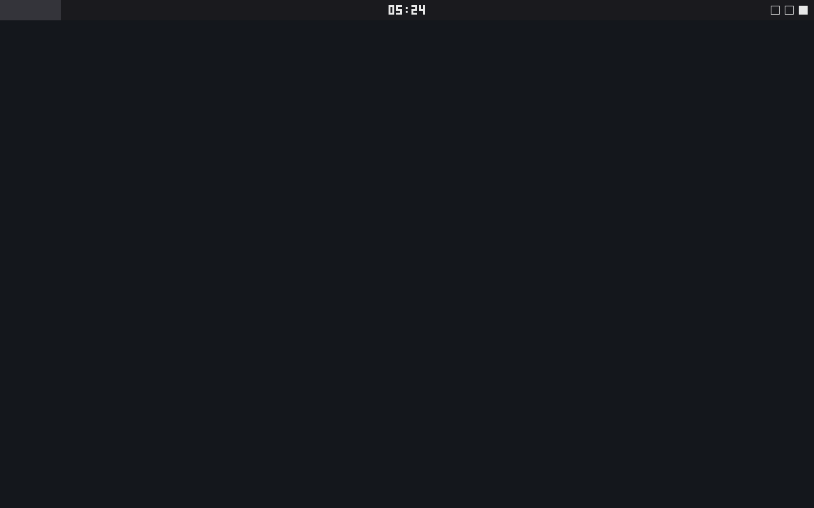
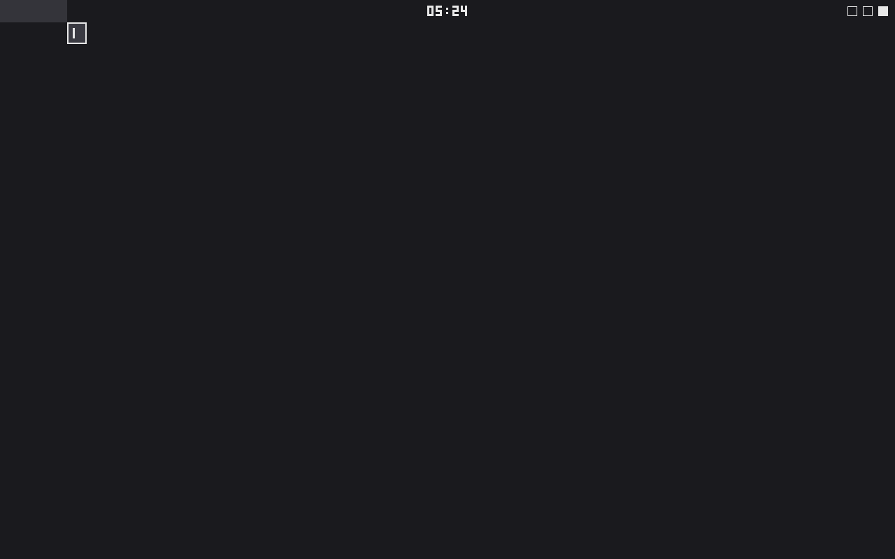
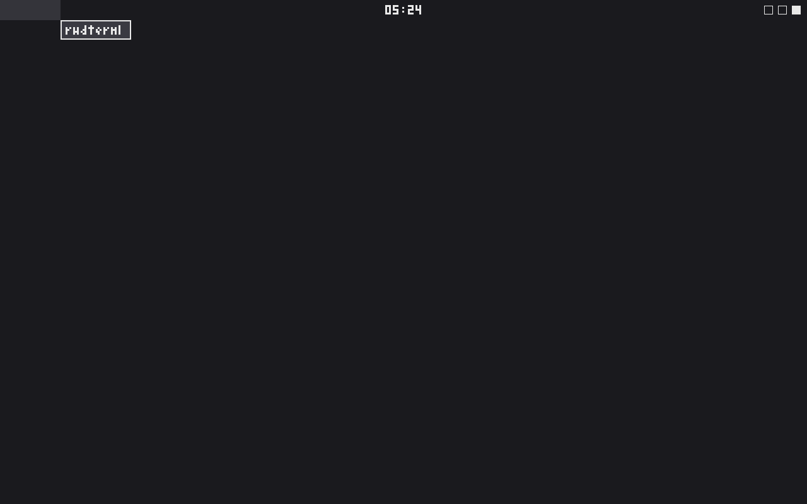
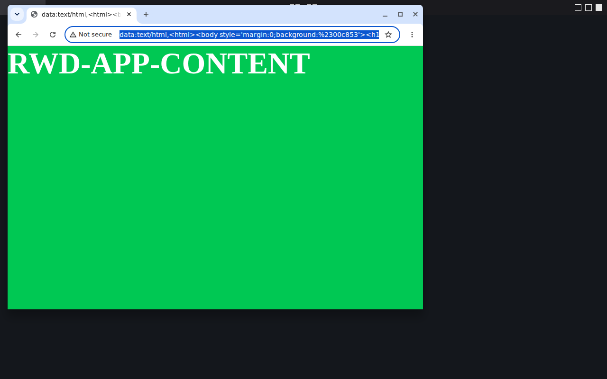
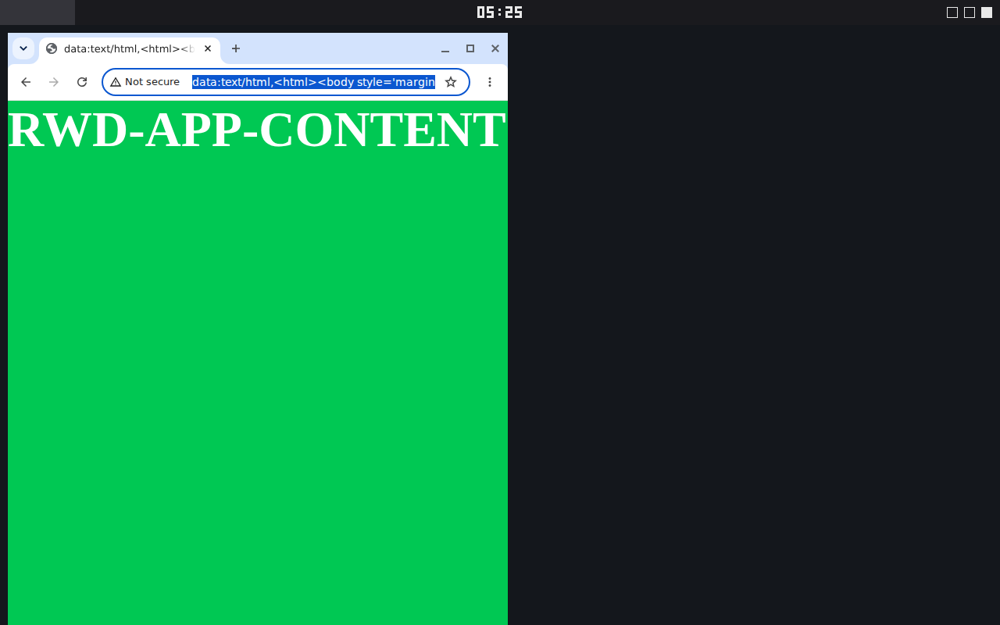
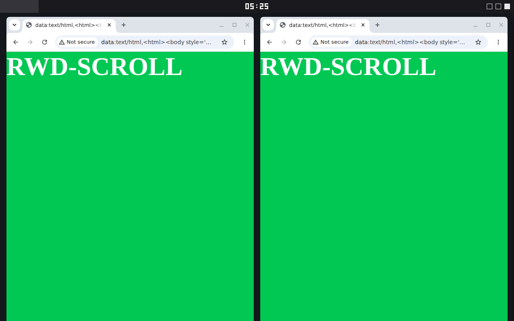
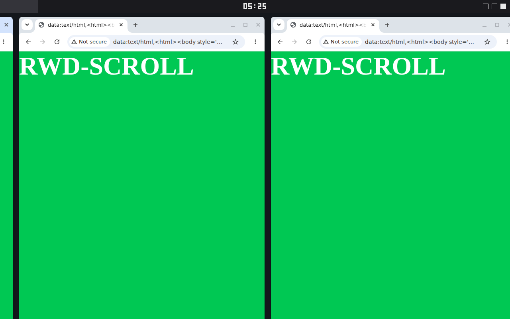

# Screenshots

What the session looks like today. Every frame below is machine-generated,
not hand-picked: each comes from the scripted proof harnesses
(`scripts/rwd-journey`, `scripts/rwd-app-content`,
`scripts/rwd-scroll-proof`) running headed clients against the nested
compositor. Proof frames show the test session as it is — an empty desktop
with the panel, a typed search query, solid-color test pages — rather than
a staged setup.

## Desktop and panel

Empty session with the top panel: clock centered, status indicators right.

## Overview and search

`Super` opens the overview; typing filters the app list. The journey types
`rwdterm` and launches the match with `Enter` (the harness proves the
launch happened via a marker file — the frame itself just shows the query).

## Application windows

A real client (headed Chromium over Wayland) mapped floating, then snapped
with `Super+Left`. The harness asserts the app pixels are actually ours:
baseline-vs-app diff plus app-color pixel count.

## Scrollable tiling (PaperWM/niri mode)

`Super+Shift+T` turns the whole session into a horizontal strip: even
16px gaps, half-screen columns by default, the focused column leading.
`Super+R` cycles 1/3–1/2–2/3 presets; the mouse wheel (or
`Super+Left/Right`) scrolls the strip one column at a time.

## Refreshing these shots

`scripts/rwd-docs-shots collect <journey-dir> <app-dir> <scroll-dir>`
curates the set above out of harness artifact directories under stable
names. `scripts/rwd-docs-shots regen` re-runs all three harnesses locally
first — that is the release-time refresh. CI does the same per run: the
`docs-shots` job collects from the run's own proof artifacts and uploads
the bundle (kept 90 days), so each release copies its screenshots from a
green run instead of reusing stale frames. The panel clock renders live,
so a fresh set always differs from the committed one by its digits —
that churn is expected, not staleness.
